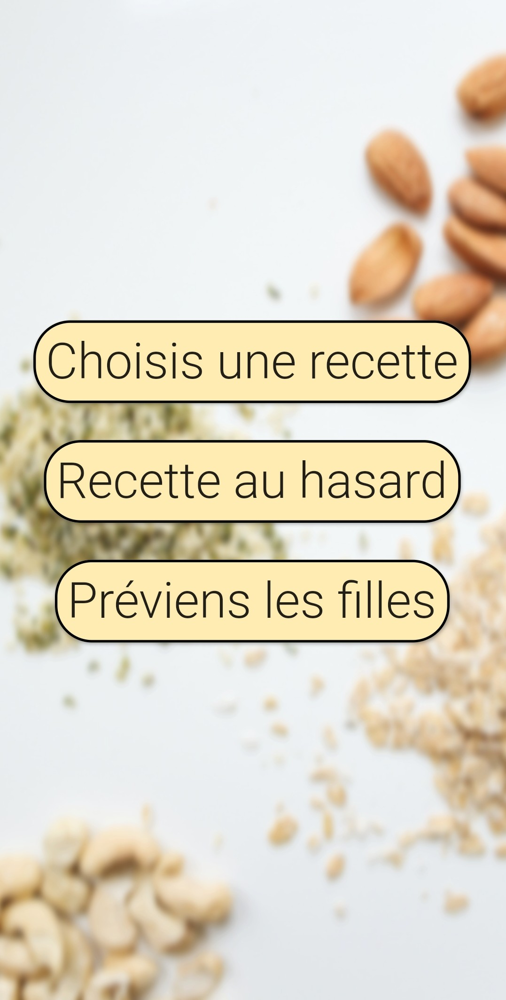
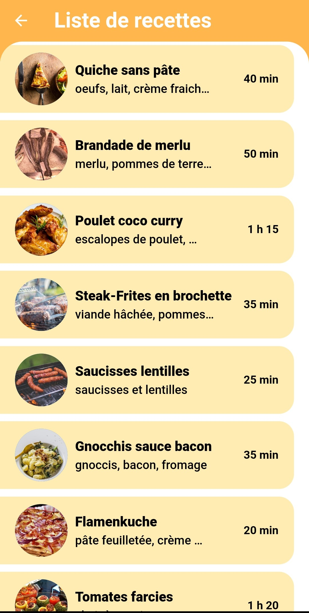
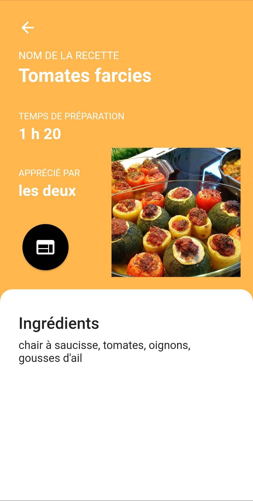

# Flutter Cooking help app

A Flutter app I gifted to my mom for Mother's Day.
Also my first ever Flutter app.

## Features
- [x] upon choosing a recipe, displays a list of recipes approved by my sister and I
- [x] displays recipe details such as a picture, time required, ingredients and a link to the recipe
- [x] upon suggest a recipe, chooses randomly a recipe amongst the list items and displays its details
- [x] sends a text message (to configure for yourself) to whomever you want saying dinner is ready 
(in French, because I'm French)

## ScreenShots
  

## Dependencies and Flutter packages
| Name | Usage |
|------|-------|
|[**url_launcher**](https://pub.dev/packages/url_launcher)| opens recipe link in browser|
|[**sms**](https://pub.dev/packages/sms)| sends text messages: can cause build issues|

## Code organization
- Models: Recipe class and list of recipes (with data) declaration
- Screens: all screens [ HomeScreen, ChooseRecipeScreen and RecipeDetails ]
- Widgets: the recipes list

## Author
**Lou Cherensac** 
